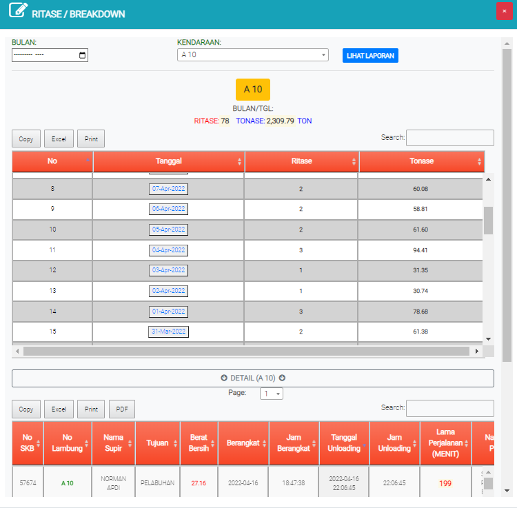

# Laporan Hauling Detail Kendaraan

### RINCIAN PENERIMAAN BB

Tabel ini menginformasikan setiap tipe kendaraan yang mengalami kerusakan perhari

### RITASE BREAKDOWN/PARKIR/NON AKTIP

Tabel ini menginformasikan rincian setiap kendaraan yang mengalami kerusakan, parkir, dan Non-aktip.

### RITASE BREAKDOWN

Tampilan ini akan muncul ketika mengklik nomor lambung kendaraan. Laporan memperlihatkan informasi setiap kendaraan yang dipilih, user bisa mencari periode dan nomor lambung yang dicari
